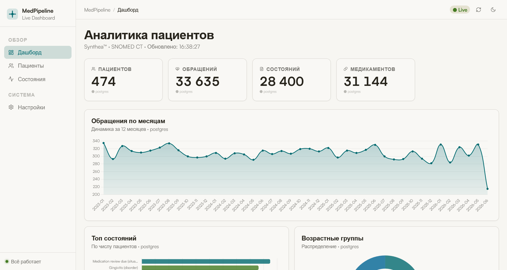

# 🏥 Medical Data Pipeline

[](https://python.org)
[](https://spark.apache.org)
[](https://nifi.apache.org)
[](https://docker.com)
[](LICENSE)

Масштабируемый Big Data пайплайн для обработки синтетических
медицинских записей в формате **FHIR R4**. Генерирует данные
через Synthea, маршрутизирует через Apache NiFi, обрабатывает
в Spark, хранит в Hive + PostgreSQL и отображает
на интерактивном Flask-дашборде.



## 📋 Содержание

- [Архитектура](#архитектура)
- [Стек технологий](#стек-технологий)
- [Быстрый старт](#быстрый-старт)
- [API](#api)
- [Лицензия](#лицензия)

## 🏗 Архитектура
Synthea → Apache NiFi → HDFS → Apache Spark → Hive
↓
PostgreSQL → Flask API → Dashboard

| Этап | Инструмент | Описание |
|------|-----------|---------|
| Генерация | Synthea | ≥404 пациентов, штат Massachusetts, 5 лет истории |
| Ингestion | Apache NiFi 1.23.2 | GetFile → SplitText → RouteOnAttribute → PutHDFS |
| Хранение | Hadoop HDFS 3.2.1 | 5 директорий (Patient, Condition, Encounter…) |
| ETL | Apache Spark 3.0 | PySpark, нормализация FHIR, SHA-256 анонимизация |
| Аналитика | Apache Hive + PostgreSQL | External Tables (Parquet) + агрегатные таблицы |
| Дашборд | Flask + Chart.js | 10+ REST-эндпоинтов, live-обновление |

## 🛠 Стек технологий

- **Big Data:** Apache Spark 3.0, Hadoop 3.2.1, Apache Hive 2.3
- **Оркестрация:** Apache NiFi 1.23.2
- **Базы данных:** PostgreSQL 15, Hive Metastore
- **Бэкенд:** Python 3.10, Flask, psycopg2, PyHive
- **Фронтенд:** Vanilla JS, Chart.js, Lucide Icons
- **Инфраструктура:** Docker Compose, Hue
- **Данные:** Synthea, FHIR R4, SNOMED CT, ICD-10

## 🚀 Быстрый старт

### Требования

- Docker + Docker Compose
- Java 17 (для сборки Synthea)
- 32 ГБ RAM (рекомендуется)
- 30 ГБ свободного места на диске

### Установка

```bash
# Клонировать репозиторий
git clone https://github.com/applenesid/medical-pipeline.git
cd medical-pipeline

# Запустить установку (займёт 15–30 минут)
chmod +x install.sh
./install.sh

# Запустить Spark ETL
chmod +x spark.sh
./spark.sh
```

### Доступные сервисы после запуска

| Сервис | URL | Логин / Пароль |
|--------|-----|----------------|
| 📊 Dashboard | http://localhost:8090 | — |
| 🌀 NiFi UI | https://localhost:8443/nifi | admin / admin_password123 |
| 🐝 Hue (SQL) | http://localhost:8888 | root / — |
| 🐘 HDFS Web UI | http://localhost:9870 | — |
| ⚡ Spark UI | http://localhost:8080 | — |

## 🔌 API

| Метод | Эндпоинт | Описание | Источник |
|-------|---------|---------|---------|
| GET | `/api/kpi` | Общая статистика | PostgreSQL |
| GET | `/api/timeline` | Динамика визитов | PostgreSQL |
| GET | `/api/conditions` | Топ диагнозов | Hive / PG |
| GET | `/api/patients` | Список пациентов | PostgreSQL |
| GET | `/api/age` | Демография по возрасту | PostgreSQL |
| GET | `/api/status` | Статус компонентов | PostgreSQL + Hive |

## 📄 Лицензия

MIT © 2026 Applenesid x mcipan
